# Super Twisting Sliding Mode control of a Quadrotor for Fault Tolerance

  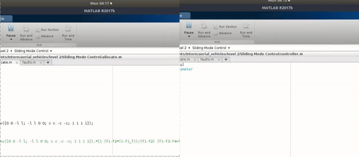

** With out Super Twisting Sliding Mode Controller with Control Allocation (left). With Super Twisting Sliding Mode Controller with Control Allocation (right). **  
 
 

A quadrotor has complex system dynamics with a variety of system states variables. That being said, the number of inputs available doesn’t allow the quadrotor to have input redundancy. This makes it difficult for controlling an under actuated quadrotor. If situational discrepancy leads to the under performance of the propeller actuators, the quadrotor loses its control and fails to follow the desired trajectory. The under performance can be really risky leading to the crash landing of the quadrotor. Considering the high-cost sensors and the load mounted on the quadrotor, crash landing can be a serious loss and dangerous for the surrounding environment. To overcome such situations, a fault tolerant controller has been designed to trigger appropriate control on the detection of faults among the propeller actuators.

Among various control algorithms, Sliding Mode Control (SMC) has been observed to produce robust results on control of underactuated systems. Since SMC produces an undesirable high frequency chattering effect, an alternative has been provided to replace the nonlinear switching function. Super Twisting Sliding Mode Control (STW SMC) is implemented to remove such undesirable high frequency chattering. On detection of the faults using state estimators, a control allocation algorithm is triggered. Based on appropriate loss of actuator effectiveness (LAE), control allocation is implemented and the quadrotor is made to follow the trajectory and land safely without any disturbances. The following will elaborate on the mathematical modelling and controller design to implement such a FTC for the quadrotor.

**The controller block diagram:**

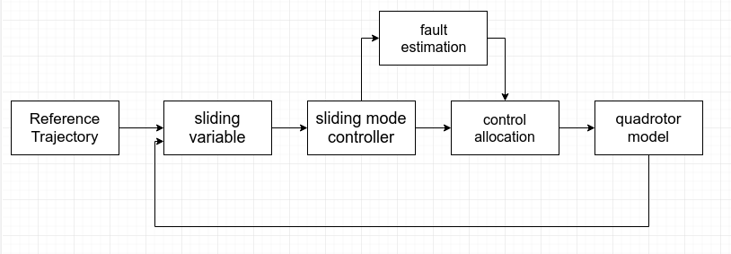

**Trajectory Tracking results:**

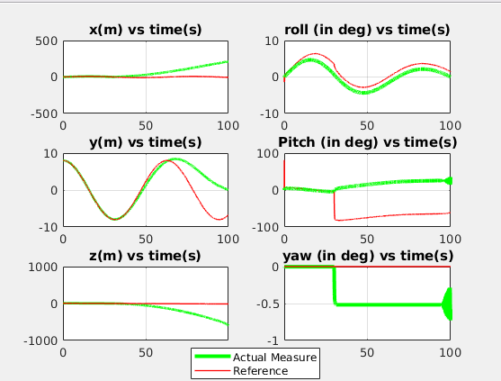

     Super twisting control without control allocation

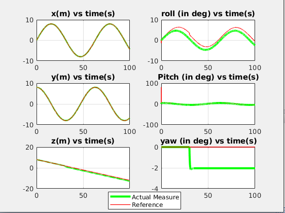

     Super twisting control with control allocation

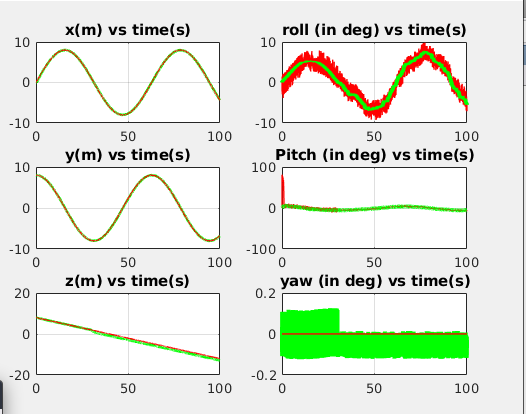
       
     Nominal Sliding mode control with control allocation

**Control inputs for tracking trajectory:**

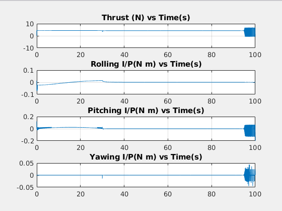
 

     Super twisting control without control allocation

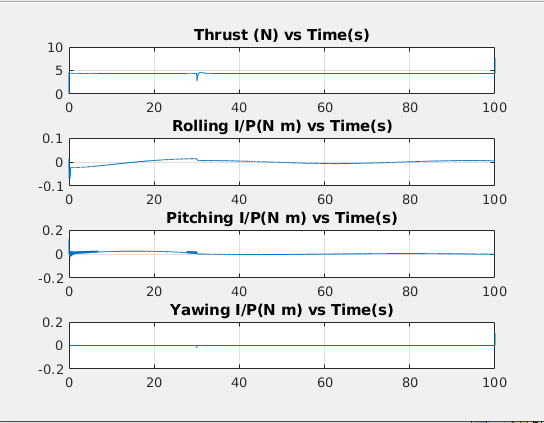

     Super twisting with control allocation

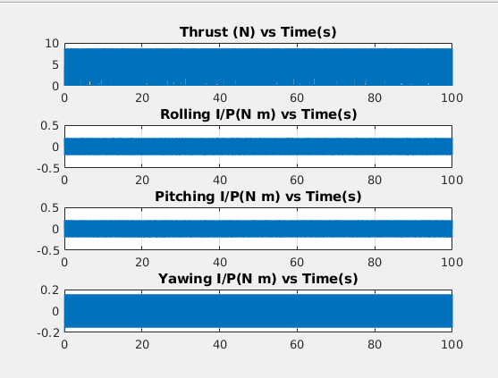

     Nominal Sliding mode control with control allocation

**Error while tracking trajectory:**

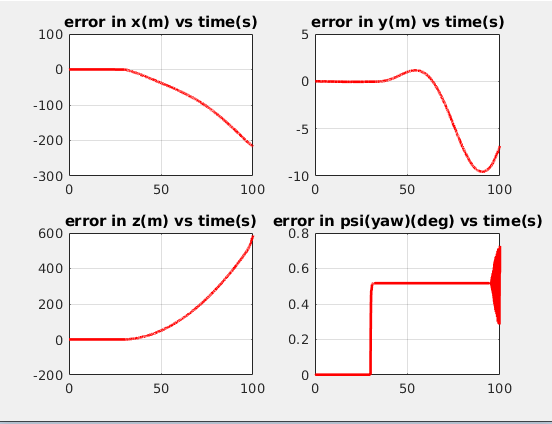

     Super twisting SMC without control allocation

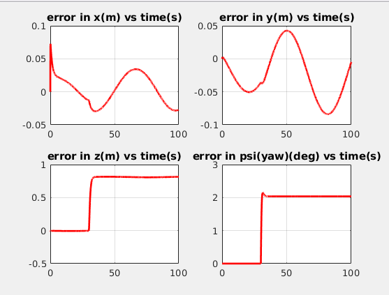
 

     Super twisting SMC with control allocation

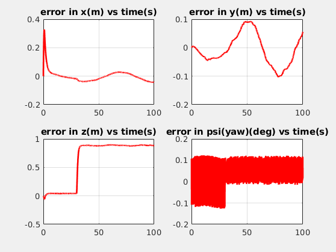

     Nominal SMC with control allocation

